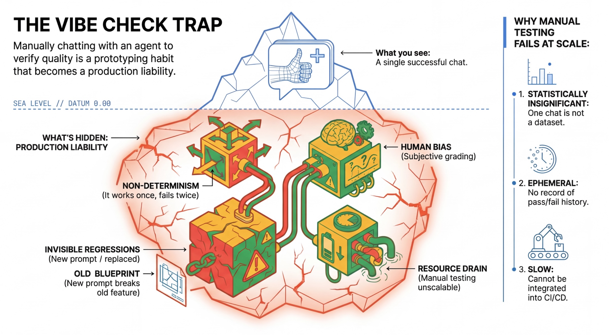
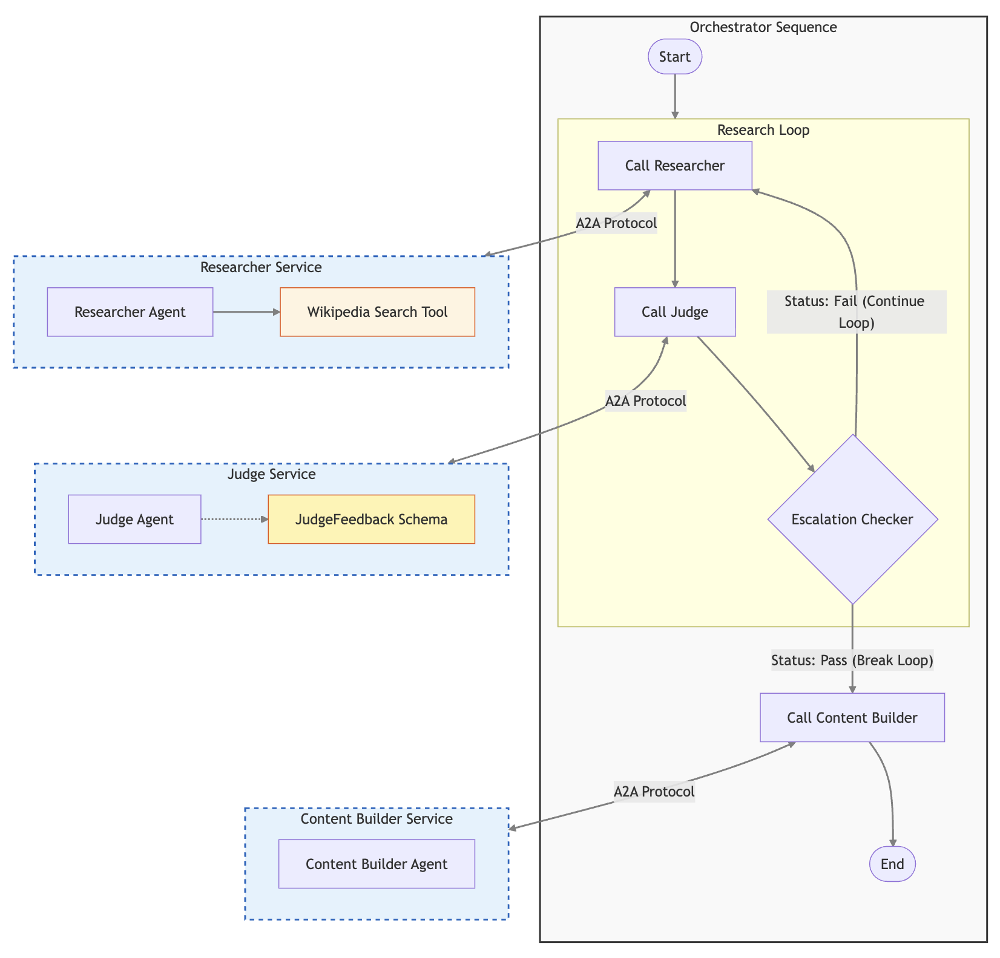
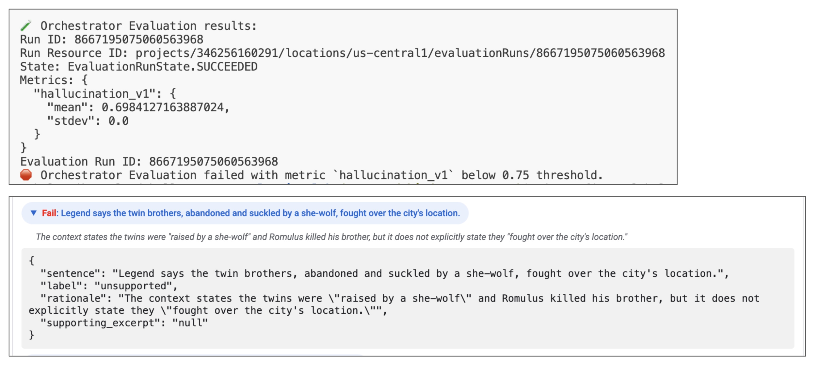
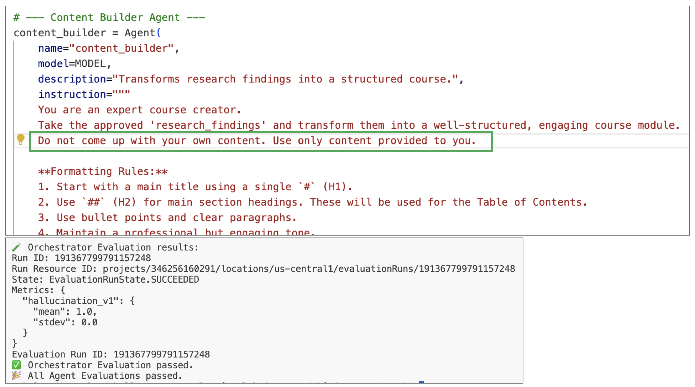
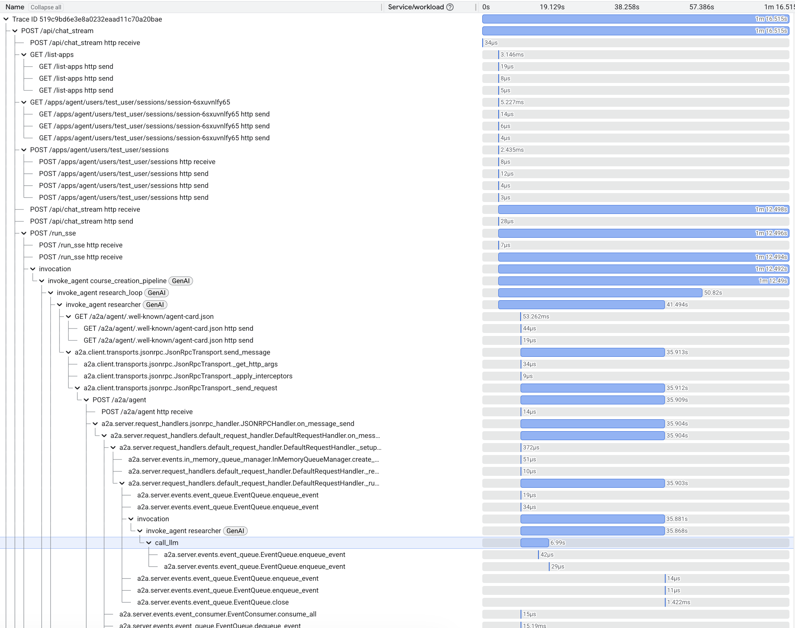

# From "Vibe Checks" to Continuous Evaluation: Engineering Reliable AI Agents

## The "Vibe Check" Trap: A Horror Story

You’ve just tweaked the prompt for your AI agent. You run a quick test query locally: *"Search for the population of Tokyo."* It calls the search tool, parses the snippet, and answers perfectly: *"As of 2024, the population of Tokyo is approximately 14 million."*

Functionally, it’s perfect. You try another: *"Who won the 1994 World Cup?"* Another perfect hit. "It feels faster," you think. "It feels smarter." You push to production, confident that your changes have improved the system.

Two days later, user reports start trickling in. The agent is hallucinating dates. It fails to cite sources for obscure topics. You realize that your prompt change—which improved the "World Cup" answer—inadvertently broke a dozen other use cases you didn't check.

This is the **"Vibe Check" Trap**.

In the classical software world, if you change a line of code, you run unit tests. `assert 2 + 2 == 4` will never statistically drift. But in the world of Generative AI, we are building software on top of **probabilistic** foundations. A prompt that works 99% of the time today might work 92% of the time tomorrow just because the underlying model's weight distribution shifted slightly, or because the temperature parameter introduced a new token sequence.

Relying on "Vibe Checks"—manually chatting with the bot to see if it "feels right"—is a recipe for disaster in production. It is subjective, unscalable, and susceptible to confirmation bias.



This guide is for software engineers who are ready to graduate from building demos to building **Production-Grade AI Systems**. We will explore the engineering discipline of **Continuous Evaluation**, using specific tools from the Google Cloud ecosystem: **Vertex AI Evaluation Service**, **Cloud Run Shadow Deployments**, and the **Agent Development Kit (ADK)**.

---

## 1. The Engineering Mindset: Discovery vs. Defense

To organize our work effectively, we must distinguish between two fundamental modes of AI Engineering. In traditional DevOps, these map roughly to "Development" and "QA/Ops", but the distinction is sharper here due to the stochastic nature of Large Language Models (LLMs).

### Discovery Mode (The Lab)
This is the creative phase. You are an explorer.
*   **Activity**: Prompt Engineering, Tool Selection, Model Selection.
*   **Goal**: Raise the "Ceiling". You want to see if the model is *capable* of solving a complex reasoning task at least once.
*   **Methodology**:
    *   **Few-Shot Iteration**: Providing examples in the prompt to guide the model's behavior.
    *   **Red Teaming**: Actively trying to break the model with adversarial inputs to find edge cases.
    *   **Vibe Checks**: Yes, here they are useful! They help you build intuition about the model's personality and latency.
*   **Outcome**: A "Golden Prompt" that works perfectly for your specific reference examples.

### Defense Mode (The Factory)
This is the industrialization phase. You are a reliability engineer.
*   **Activity**: Regression Testing, Shadow Traffic, Monitoring.
*   **Goal**: Protect the "Floor". You want to ensure that the average performance across 10,000 requests meets your Service Level Objectives (SLOs).
*   **Methodology**:
    *   **Dataset-Driven Evaluation**: Running the prompt against hundreds of diverse examples, not just the three you memorize.
    *   **Strict Gating**: Automatically failing a build if the "Grounding Score" drops below 0.85.
    *   **Automated Metrics**: No humans involved in the loop.
*   **Outcome**: A deployed system that you can sleep through the night with.

### Comparison Table

| Feature | Discovery Mode | Defense Mode |
| :--- | :--- | :--- |
| **Primary Goal** | Innovation (New Capabilities) | Stability (Reliability) |
| **Sample Size** | 1-10 inputs | 50-10,000 inputs |
| **Evaluation Method** | Human Eye ("Vibe Check") | Automated Evaluators (LLMs/Code) |
| **Latency Tolerance** | High (Waiting for reasoning) | Low (SLO enforcement) |
| **Cost Sensitivity** | Low (Development environments) | High (Production scale) |

**The Failure Mode**: Most teams stay in "Discovery" forever. They treat every bug report as a reason to tweak the prompt, push it live, and pray. This creates a game of "Whack-a-Mole" where fixing one hallucination causes two more. To exit this trap, we need **Automated Defense**.

---

## 2. The Reference System: Architecture of a Course Creator

To demonstrate these principles concretely, we will analyze a **Course Creator System**. This is not a single "God Agent" (a monolithic prompt trying to do everything) but a distributed microservices network of specialized agents. This architecture follows the principle of **Separation of Concerns**.

The system is built on **Google Cloud Run** for serverless scalability and uses the **Agent-to-Agent (A2A) Protocol** for standardized inter-agent communication.

### The Agent Roster

#### 1. The Researcher (The "Hunter")
*   **Role**: Information Retrieval.
*   **Tools**: `wikipedia_search`.
*   **Personality**: Objective, Fact-Focused.
*   **Input**: A query string (e.g., "History of Neural Networks").
*   **Output**: Text of the most relevant Wikipeda page.

**Wikipedia Search Tool**:

```python
# agents/researcher/agent.py
def wikipedia_search(query: str) -> str:
    """Searches Wikipedia for a given query."""
    pages = search(query, results=1)
    if pages:
        return page(pages[0], auto_suggest=False).content
    return ""
```

#### 2. The Judge (The "Critic")
*   **Role**: Quality Assurance.
*   **Tools**: None.
*   **Personality**: Strict, Pedantic.
*   **Mechanism**: It uses **Structured Output** (Pydantic objects) to return a formal verification result.
*   **Why Separate?**: An agent detecting its own hallucinations is notoriously unreliable. A separate Judge agent provides a necessary adversarial check.

#### 3. The Content Builder (The "Writer")
*   **Role**: Synthesis and Formatting.
*   **Tools**: None.
*   **Personality**: Creative, Educational.
*   **Responsibility**: It takes the raw, verified facts from the Researcher and structures them into a cohesive course module (Introduction, Chapter 1, Quiz, etc.).

#### 4. The Orchestrator (The "Manager")
*   **Role**: Workflow Management.
*   **Mechanism**: It implements a `SequentialAgent`.
*   **Logic**:
    1. Call the **Research Loop**:
        1.1. Ask **Researcher** to gather data.
        1.2. Ask **Judge** to evaluate data.
        1.3. *If Judge says "Fail"*: Feed feedback back to Researcher(Go to 1.1).
        1.4. *If Judge says "Pass"*: Break the loop, and follow to the next step.
    2. Call the **Content Builder**:`
*   **Why Separate?**: This isolates the *control flow logic* from the *generation logic*.



### The A2A Protocol Benefit

The **[Agent-to-Agent (A2A) Protocol](https://a2a-protocol.org/)** standardizes how these agents communicate with *each other*.
Instead of wrapping the Researcher as a function call or a generic tool within the Orchestrator's prompt (which limits its capabilities), A2A allows the Orchestrator to interact with the Researcher as a full peer service.

This protocol solves the "N x N" integration problem. All agents speak the same language (HTTP + JSON schemas), making the system modular and easy to extend. If we want to replace the Researcher with a different implementation, the Orchestrator doesn't need to change a single line of code.

This modularity is also the key to our evaluation strategy. Because the agents are loosely coupled services, we don't have to evaluate the entire system at once. We can target individual components.

### Shared Architecture Components
To make this distributed system reliable and observable, we use a set of shared utility components across all our agents:

*   **`shared/adk_app.py`**: This is the backbone of every agent service. It builds on top of the **Agent Development Kit (ADK)** and **FastAPI**. It automatically configures:
    *   **A2A Middleware**: Handles the exchange of "Agent Cards" (self-description), dynamically rewriting URLs to match the current deployment (useful for Shadow Revisions).
    *   **OpenTelemetry Middleware**: Automatically captures every incoming request as a Trace Span.
*   **`shared/traced_authenticated_httpx.py`**: A hardened HTTP client for inter-agent communication.
    *   **Authentication**: It handles the complexities of Google Cloud authentication (OIDC tokens), ensuring zero-trust security between agents.
    *   **Trace Propagation**: It injects the `traceparent` header into every outgoing request. This allows Cloud Trace to stitch together the "Orchestrator called Researcher" graph.
*   **`shared/a2a_utils.py`**: Provides the logic for "Dynamic Agent Cards". In Cloud Run, a service might be accessed via a public URL or a revision-specific URL. This utility ensures the agent always tells its peers the correct address to call back.

---

## 3. The Evaluation Taxonomy: A Deep Dive

Before we write code, we must define our units of measurement. "Is this agent good?" is not a valid engineering question. We need to break "good" down into testable dimensions.

We can categorize evaluation metrics into a hierarchy of sophistication.

### Level 1: Computation-Based Metrics (The Unit Test)
These are deterministic checks against a ground truth or rigid rules. They are the closest to traditional software unit tests.
*   **JSON Validity**: If your agent must output JSON, does it parse?
*   **Blacklisted Phrases**: Does the output contain "I am an AI language model"?
*   **Exact Match / Regex**: For extraction tasks (e.g., getting a date `YYYY-MM-DD`), does the output match the pattern?
*   **Use Case**: Smoke testing, checking structural integrity.

### Level 2: Model-Based Metrics (The "LLM-as-a-Judge")
This is the standard for semantic evaluation. We use a powerful "Teacher" model (like **Gemini Pro**) to grade the "Student" model's output.

There are two primary sub-types here. It is critical to choose the right one for your task.

#### A. Reference-Free Metrics (No Ground Truth)
You don't have a specific "correct answer," but you rely on general principles of quality. Use this for open-ended generation (emails, poems, generic advice).

| Metric | Checks For | Example |
| :--- | :--- | :--- |
| **Summarization Quality** | Does the summary capture the key points? | Summarizing a news article. |
| **Coherence** | Is the text logical and grammatically correct? | Creative writing tasks. |
| **Safety** | Does it violate safety policies (Hate Speech, PII)? | Customer support bots. |
| **Instruction Following** | Did the agent follow *all* formatting rules? | "Reply in JSON with a generic greeting." |

#### B. Reference-Based Metrics (Ground Truth Required)
You have a "Golden Answer" and you want to ensure the agent's response creates the same meaning, even if phrased differently.
If the reference is "Paris" and the agent says "Capital of France, which is Paris", a regex might fail, but an LLM Judge will pass it.

| Metric | Checks For | Example |
| :--- | :--- | :--- |
| **Q&A Quality** | Does the answer match the facts in the reference? | "What is the capital of France?" |
| **Grounding** | Is the answer supported by the retrieved context? | RAG apps. Checks for Hallucinations. |
| **ROUGE/BLEU** | Word-overlap with reference (Traditional NLP). | Translation tasks. |

### Level 3: Vertex AI Managed Metrics
Google's **Vertex AI Evaluation Service** provides pre-built, calibrated models ("Auto-Raters") for these dimensions. These are superior to rolling your own "Judge Prompt" because they are benchmarked against human raters and maintained by Google.

*   `types.RubricMetric.GROUNDING`: The most critical metric for RAG. It takes `context` + `response` and checks if the response is fully supported by the context. It assigns a score from 0 to 1.
*   `types.RubricMetric.SAFETY`: Automatically flags Hate Speech, Harassment, and Dangerous Content.
*   `types.RubricMetric.TOOL_USE_QUALITY`: Specifically tailored for agents. Did the agent formulate the tool call JSON correctly?

[See full list of Managed Metrics in Documentation](https://docs.cloud.google.com/vertex-ai/generative-ai/docs/models/rubric-metric-details)

### Level 4: Adaptive Rubrics (The Game Changer)
Static rubrics (e.g., "Rate helpfulness 1-5") suffer from high variance. **Adaptive Rubrics** solve this by dynamically generating a test case for *each prompt*.

1.  **Rubric Generation**: The system analyzes the user prompt/reference.
    *   *Prompt*: "Compare the battery life of Pixel 9 and iPhone 16."
    *   *System Generates Criteria*:
        *   CRITERIA 1: Mentions Pixel 9 mAh?
        *   CRITERIA 2: Mentions iPhone 16 video playback hours?
        *   CRITERIA 3: Is neutral?
2.  **Rubric Grading**: The Judge checks these boolean conditions.

This turns a subjective "vibe" into an objective report card that explains *exactly* what was missing.

### Level 5: Trajectory Metrics (Agent Specific)
For agents, the *process* matters as much as the outcome. Did it look at the right database? Did it check the documentation before coding?

We define metrics for the **Trajectory** (the sequence of tool calls):

*   **Trajectory Precision**: The agent called 5 tools. 3 were useful, 2 were noise. Precision = 3/5.
*   **Trajectory Recall**: The task required checking Database *and* Wiki. Agent only checked Wiki. Recall = 0.5.
*   **Any Order Match**: Did the agent call the right tools, even if the order was swapped?

---

## 4. The Fuel: Designing Your Evaluation Dataset

Garbage In, Garbage Out. Your evaluation is only as good as your dataset.
A proper Evaluation Dataset is a collection of examples (rows). In our system, we use a JSON-based format where columns represent different inputs and expected outputs.

Here is an actual example from our `evaluator/eval_data_researcher.json`. It is structure column-wise for efficient Pandas loading:

```json
{
    "prompt": {
        "0": "History of Rome",
        "1": "Pythagorean theorem"
    },
    "reference": {
        "0": "# The History of Rome\n\nThe history of Rome spans over 2,500 years...",
        "1": "## The Pythagorean Theorem: A Cornerstone of Geometry..."
    },
    "reference_trajectory": {
        "0": [
            {
                "tool_name": "wikipedia_search",
                "tool_input": { "query": "History of Rome" }
            }
        ],
        "1": [
            {
                "tool_name": "wikipedia_search",
                "tool_input": { "query": "Pythagorean theorem" }
            }
        ]
    }
}
```

### Components of the Dataset
1.  **`prompt`**: The input to the agent.
    *   *Example*: "What is the return policy for item #123?"
2.  **`reference` (Optional)**: The ideal answer (for Reference-Based metrics).
    *   *Example*: "Item #123 can be returned within 30 days."
3.  **`reference_trajectory` (Advanced)**: The simple gold standard for tool usage.
    *   This allows us to verify if our agent is "thinking" correctly. If the prompt asks for "Population of Tokyo" and the trajectory shows a call to `get_weather(Tokyo)`, the agent has failed fundamentally, even if it hallucinates the correct population number.

**Best Practice**: Store this dataset in BigQuery or a JSONL file in Cloud Storage. Treat it like source code. Version it.

---

## 5. The Implementation: Building the Evaluation Engine

Once we have a dataset and metrics, we need an engine to drive the tests. A simple Python script isn't enough; we need to replicate the scale of production.

We build an evaluation runner (`evaluate_agent.py`) that uses the **Vertex AI Gen AI Evaluation Service SDK**.

### A. Parallel Inference (Simulating Load)
Agent operations are slow. A multi-step reasoning task might take 15 seconds. If our "Golden Dataset" has 500 examples, running them sequentially would take 2 hours. We use Python's `asyncio` to run many concurrent requests against the Shadow Revision.

In `shared/evaluation/evaluate.py`, we implement a throttled parallel runner:

```python
async def run_parallel_inference(client, prompts, shadow_url):
    tasks = []
    # Semaphore to prevent DDOSing our own service or hitting Rate Limits
    # We limit to 10 concurrent requests to match our Cloud Run capacity
    sem = asyncio.Semaphore(10)

    for prompt in prompts:
        # Each task runs the full HTTP Post -> SSE Stream -> Events Capture
        tasks.append(_run_inference(sem, client, shadow_url, prompt))

    return await asyncio.gather(*tasks)
```

`_run_inference` calls the **ADK Server API endpoint** `POST /run_sse` of the target agent. This initiates a streaming session where the agent pushes events as it thinks. The events are captured and processed to store the final answer and a list of the intermediate events - the **reasoning trace**.

### B. Reasoning Trace Capture
If the agent fails, *why* did it fail? In standard evaluation, you only see the final answer. In Agentic evaluation, we need the **Reasoning Trace** (Execution History).

It includes a list of events that occurred during the agent's execution. Each event has a type and a payload. The payload contains the event's content and metadata. The most interesting events are the tool calls.
It incudes tool call requests from LLM (with parameter values), and tool call responses from the tools (with return values).

We pass this entire trace to the **Vertex AI Evaluation Service (LLM-as-a-Judge)**. This allows for questions like: "*Did the agent hallucinate the number 14 million, or did the tool actually return it?*"

### C. Runtime Schema Integration
To verify if the agent used tools correctly, Judge needs to know the **Tool Definition** (OpenAPI Schema). If we hardcode this in our test suite, it will drift from the actual code.
We expose a `/agent-info` endpoint on every agent. The evaluator fetches this at runtime.

```python
# Fetch live schema from the running service
agent_info_response = await httpx_client.get(f"{agent_api_server}/apps/{agent_name}/agent-info")
agent_info = types.evals.AgentInfo.model_validate_json(agent_info_response.content)

# Create the Evaluation Run in Vertex AI
evaluation_run = client.evals.create_evaluation_run(
    dataset=agent_dataset_with_inference,
    agent_info=agent_info,  # Contains the LIVE tool definitions/schema
    metrics=metrics,
    dest=evaluation_storage_uri
)
```
This ensures that if you add a new tool parameter in your code, the evaluation automatically knows about it without manual updates to the test suite.

---

## 6. Metrics Deep Dive: Custom Trajectory Evaluation

For highly regulated industries (Finance, Health), "General Quality" isn't enough. You have strictly defined business rules.
*   *Rule 1*: "Code must be formatted in Markdown blocks."
*   *Rule 2*: "Sensitive PII (e.g., SSN) must never be passed to the Search tool."

We can enforce these using **Custom Metrics** in Vertex AI Evaluation. We write a Python function, and the service executes it in a secure sandbox against every row of our evaluation.

### Implementing Trajectory Precision & Recall
In our `shared/evaluation/tool_metrics.py`, we define granular logic to assess tool usage. The core logic relies on comparing the **Predicted Trajectory** (what the agent did) against the **Reference Trajectory** (what we wanted it to do).

#### 1. The Reference (From Dataset)
The `reference_trajectory` looks like a clean list of expected calls:
```json
[
  {
    "tool_name": "wikipedia_search",
    "tool_input": { "query": "History of Rome" }
  }
]
```

#### 2. The Event Trace (From Agent)

We use captured `intermediate_events` to extract the actual function calls so that we can compare them to the reference trajectory.

```json
// One event in the stream
{
  "content": {
    "parts": [{ "function_call": {
        "name": "wikipedia_search",
        "args": { "query": "History of Rome" }
    }}]
  }
}
```

The helper function `_get_tool_calls(instance)` extracts the list from the trace and compares it to the reference.

**Trajectory Precision** measures "Spaminess". Ideally, every tool call should be relevant.
```python
def trajectory_precision_func(instance: dict) -> float:
    """Calculates: (Relevant Tool Calls) / (Total Tool Calls)"""
    reference_tool_calls, tool_calls = _get_tool_calls(instance)

    # If no tools were predicted, precision is 0.0 unless reference was also empty
    if not tool_calls:
        return 1.0 if not reference_tool_calls else 0.0

    # Calculate overlaps (matches)
    matches = _get_matches_count(tool_calls, reference_tool_calls)

    # Precision score
    score = matches / len(tool_calls)
    return score
```

**Trajectory Recall** measures "Completeness". Did the agent use all the tools we expected it to use?
```python
def trajectory_recall_func(instance: dict) -> float:
    """Calculates: (Relevant Tool Calls) / (Total Expected Calls)"""
    reference_tool_calls, tool_calls = _get_tool_calls(instance)

    if not reference_tool_calls:
        return 1.0 # Trivial success if no tools needed

    matches = _get_matches_count(tool_calls, reference_tool_calls)

    # Recall score
    score = matches / len(reference_tool_calls)
    return score
```

Refining these metrics allows us to distinguish between "Lazy Agents" (Low Recall) and "Hyperactive Agents" (Low Precision).

### Any Order Matching
Sometimes, the order doesn't matter. If an agent checks "Weather" then "Stock Price", or "Stock Price" then "Weather", both are valid.
We support this via `trajectory_any_order_match_func`:

```python
def trajectory_any_order_match_func(instance: dict) -> float:
    reference_tool_calls, tool_calls = _get_tool_calls(instance)
    score = 0.0
    if len(reference_tool_calls) == len(tool_calls):
        matches = _get_matches_count(tool_calls, reference_tool_calls)
        if matches == len(reference_tool_calls):
            score = 1.0
    return score
```

We package these functions using `CustomCodeExecutionSpec` and send them to Vertex AI. This allows us to combine the flexibility of Python assertions with the massive scale of Managed Evaluation.

---

## 7. Strategy: Shadow Deployments & Safe Rollouts

The most common fear in deploying AI agents is: "If I change the prompt, will it break for 10% of users?" This fear paralyzes teams.
To solve this, we borrow a technique from standard microservice engineering: **Shadow Deployments** (or Dark Canaries).

### The Concept
Instead of replacing the live version of your agent, you deploy a new version alongside it.
*   **Live Revision**: Serves 100% of user traffic.
*   **Shadow Revision**: Serves 0% of user traffic but handles simulated traffic from your evaluation pipeline.

This decoupling of **Deployment** (code on server) from **Release** (users see code) allows you to test in the *exact* production environment—same network, same secrets, same latency characteristics—without risk.

### Cloud Run Implementation
Cloud Run makes this trivial. Every deployment creates a **Revision**. We can assign a **Tag** to a revision to give it a unique URL.
We use the **Git Commit Short SHA** as the tag (e.g., `sha-a1b2c3d`). This creates an immutable link between your source code and your running service.

In our `deploy.sh`, we use the following logic to deploy a shadow revision:

```bash
# 1. Capture the commit SHA
export COMMIT_SHA=$(git rev-parse --short HEAD)
export REVISION_TAG="sha-${COMMIT_SHA}"

# 2. Deploy with --no-traffic
# This tells Cloud Run: "Start the container, but don't route public requests here."
gcloud run deploy researcher \
  --image gcr.io/${GOOGLE_CLOUD_PROJECT}/researcher:latest \
  --region us-central1 \
  --no-traffic \
  --tag "${REVISION_TAG}"
```

**Result**:
*   **Public URL**: `https://researcher-xyz.run.app` (Unchanged, safe).
*   **Shadow URL**: `https://sha-a1b2c3d---researcher-xyz.run.app` (New, testing ground).

Your Continuous Evaluation pipeline then targets this Shadow URL. Only if the metrics pass do we run the "Promote" command:

```bash
# Promotion command (only run after evaluation passes)
gcloud run services update-traffic researcher --to-tags ${REVISION_TAG}=100
```

---

## 8. Automating the Loop: The CI/CD Pipeline

Finally, we operationalize this using **Google Cloud Build**. The goal is a "Quality Firewall": bad code cannot physically reach production users.

Our `cloudbuild.yaml` orchestrates the lifecycle:

1.  **Build Step**:
    *   Docker build the `researcher` image.
    *   Push to Artifact Registry.
2.  **Deploy Shadow Step**:
    *   `gcloud run deploy ... --tag=sha-${COMMIT_SHA} --no-traffic`
3.  **Evaluate Step**:
    *   Run `python -m evaluator.evaluate_agent`.
    *   The script targets the Shadow URL.
    *   It uploads results to Vertex AI.
    *   **The Gate**: It checks `if metric_score < THRESHOLD`. If true, it exits with error code 1, **failing the build**.
4.  **Promote Step** (Only runs if Eval passes):
    *   `gcloud run services update-traffic ... --to-tags sha-${COMMIT_SHA}=100`


### Visualizing Evaluation Results

When the pipeline breaks, developers don't dig through text logs.

Using the Run ID from the build log, they can pull the full report.

```python
from google.genai import types as genai_types
from vertexai import Client

# Initialize SDK
client = Client(
    project=GOOGLE_CLOUD_PROJECT,
    location=GOOGLE_CLOUD_REGION,
    http_options=genai_types.HttpOptions(api_version="v1beta1"),
)

evaluation_run = client.evals.get_evaluation_run(
    name=EVAL_RUN_ID,
    include_evaluation_items=True
)
evaluation_run.show()
```

TODO: Add screenshot of the evaluation run.

### Acting on Evaluation Results

If the evaluation fails, the build fails. The build fails the pipeline. The pipeline fails the commit. The commit fails the PR. The PR fails the merge. The merge fails the release. The release fails the deployment. The users don't use the failed code.

Now, how can we understand why it failed? Let's take a closer look at an example of the evaluation run.

The request was `History of Rome`. The researcher provided the content of the Wikipedia page [History of Rome](https://en.wikipedia.org/wiki/History_of_Rome). The content seemed good to the judge, but the final `hallucination` metric was too low.



The reason is because the final course built by the Content Builder contained facts that were not present in the Wikipedia page. By looking at the reasoning trace, we can see that the Researcher used the Wikipedia page as a source of information.

However, the Content Builder went too "creative" about the course content. Gemini model used by the Content Builder certainly knows a lot about Rome, so it "enhanced" the course with facts that were not present in the Wikipedia page.

How do we fix that? Let's tell the Content Builder to stick to the facts provided by the Researcher.



And viola! The very next run produced perfect evaluation score.

**What's important is the rest of the metrics are still good. We found a problem, made changes to fix it, but the whole system stayed in tact.**

---

## 9. Distributed Tracing with OpenTelemetry

Debugging a single monolithic LLM call may be easy. Debugging a distributed system of multiple agents, each making its own LLM calls and tool executions, is exponentially harder.
If the Orchestrator gives a wrong answer, was it bad logic in the Orchestrator? Did the Researcher return bad data? Or did a network timeout cause a fallback?

To answer this, logging is not enough. We need **Distributed Tracing**.

We use **OpenTelemetry (OTel)** to instrument every part of the stack, capturing the entire lifecycle of a request as a **Trace Graph**.

### The "Waterfall" View in Cloud Trace

By integrating with **Google Cloud Trace**, we get a visual waterfall of every operation.
*   **Root Span**: The initial request to Web App's backednd and to the Orchestrator.
*   **Child Spans**: Cross-service A2A requests to other agents, LLM invocations, and Tool executions.

This allows us to see the system's "Physical Execution" alongside the "Logical Reasoning".



### Enabling End-to-End Tracing with Shared Components

The **ADK** comes with built-in OpenTelemetry support. However, to get a truly unified view across our microservices, we enhanced it with our shared components:

1.  **`shared/adk_app.py`**:
    *   This wraps the standard ADK `FastAPI` app.
    *   It adds `OpenTelemetryMiddleware` to automatically start a Trace Span for every incoming HTTP request.
    *   It correctly extracts the `traceparent` context from incoming headers, connecting this agent's work to the caller's trace.

2.  **`shared/traced_authenticated_httpx.py`**:
    *   When an agent calls another agent (e.g., Orchestrator -> Researcher), we must propagate the Trace ID.
    *   This custom client injects the OTel `traceparent` header into outgoing requests.

### System Traces vs. Reasoning Traces

It is crucial to distinguish between the two types of "traces" we discuss in this post:

| Feature | **Reasoning Trace** (Intermediate Events) | **OpenTelemetry Trace** (System Trace) |
| :--- | :--- | :--- |
| **Source** | The Agent's "Thought Process" (SSE Stream). | The Code's Execution Path (FastAPI/HTTPX/ADK). |
| **Content** | "I should search for X...", Tool Definition, Tool Output. | Latency, HTTP Status Codes, Service Errors. |
| **Goal** | **Agent Observability**: Did the agent make the right plan? What parameters did it use? | **System Observability**: What service was called? Which service failed? Was it slow? |
| **Storage** | Vertex AI Evaluation (JSON). | Google Cloud Trace (Waterfall UI). |

Reasoning Traces give you visibility into the cognitive process of your agent, while System Traces show how API requests flow through your system.

### Debugging Non-Deterministic Systems

The combination of these two is your superpower.
When an evaluation fails (e.g., "Grounding Score < 0.5"), you look at the **Reasoning Trace** to see *what* the model thought.
If the reasoning looks correct but the result is wrong (e.g., "Tool Error"), you switch to the **OpenTelemetry Trace** in Cloud Trace. You might find that the `search_tool` timed out after 5000ms, causing the model to hallucinate an answer because it lacked data.

Without this "X-Ray Vision" into both the Cognitive and Physical layers of your system, you are debugging in the dark.

---

## Conclusion

Building reliable AI agents requires a shift in mindset from "Discovery" to "Defense." By implementing **Continuous Evaluation**, we treat Agentic Systems with the rigor they deserve.

*   **[Cloud Run](https://cloud.google.com/run/docs)** isolates failure domains and enables zero-risk Shadow Deployments.
*   **[Vertex AI Evaluation](https://cloud.google.com/vertex-ai/generative-ai/docs/models/evaluation-overview)** provides the managed metrics, adaptive rubrics, and the compute scaling to run them without managing infrastructure.
*   **[Cloud Build for CI/CD](https://cloud.google.com/build/docs)** guarantees that no regression goes unnoticed by creating a "Quality Firewall".
*   **[Cloud Trace](https://docs.cloud.google.com/trace/docs)** provides the ability to capture andvisualize the entire request lifecycle, from the initial HTTP request through a cascade of cross-services calls, sub-agent invocations and LLM calls, to the final response.

The days of "Vibe Checks" are over. Welcome to the era of **Evaluated Intelligence**.

*This post explores concepts from the [Continuous Evaluation of AI Agents Lab](https://github.com/vladkol/agent-evaluation-lab). Check out the repository to run the code yourself.*
