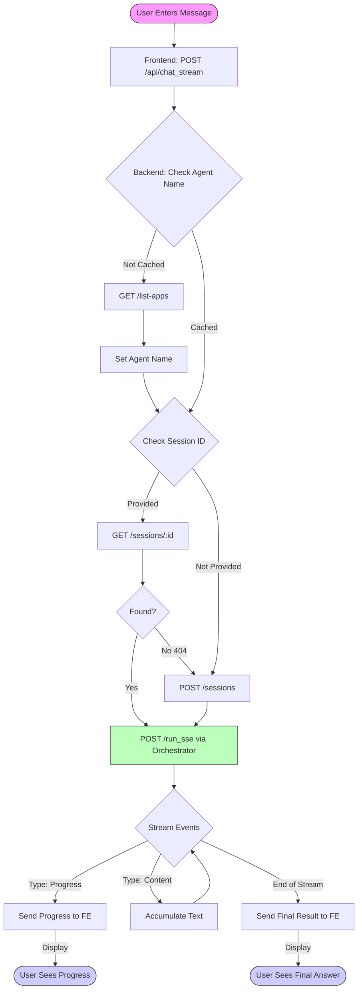

```mermaid
flowchart TD
    Start([User Enters Message]) --> FE[Frontend: POST /api/chat_stream]
    FE --> BE_Start{Backend: Check Agent Name}

    %% Agent Name Logic
    BE_Start -- Not Cached --> ListApps[GET /list-apps]
    ListApps --> SetAgent[Set Agent Name]
    SetAgent --> CheckSession
    BE_Start -- Cached --> CheckSession{Check Session ID}

    %% Session Logic
    CheckSession -- Provided --> GetSession[GET /sessions/:id]
    GetSession --> Found{Found?}
    Found -- No 404 --> CreateSession[POST /sessions]
    Found -- Yes --> RunSSE
    CheckSession -- Not Provided --> CreateSession
    CreateSession --> RunSSE

    %% Orchestrator Logic
    RunSSE[POST /run_sse via Orchestrator] --> StreamLoop{Stream Events}

    StreamLoop -- "Type: Progress" --> SendProg[Send Progress to FE]
    SendProg -- Display --> UserView([User Sees Progress])

    StreamLoop -- "Type: Content" --> Accum[Accumulate Text]
    Accum --> StreamLoop

    StreamLoop -- "End of Stream" --> SendFinal[Send Final Result to FE]
    SendFinal -- Display --> UserResult([User Sees Final Answer])

    %% Styling
    style Start fill:#f9f,stroke:#333
    style UserView fill:#ccf,stroke:#333
    style UserResult fill:#ccf,stroke:#333
    style RunSSE fill:#bfb,stroke:#333
```
